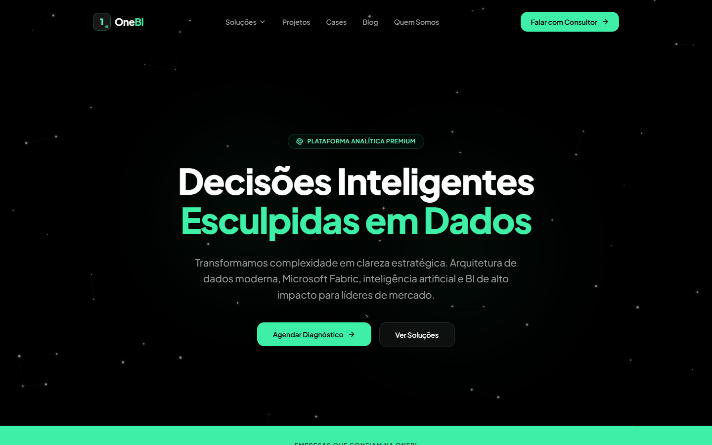
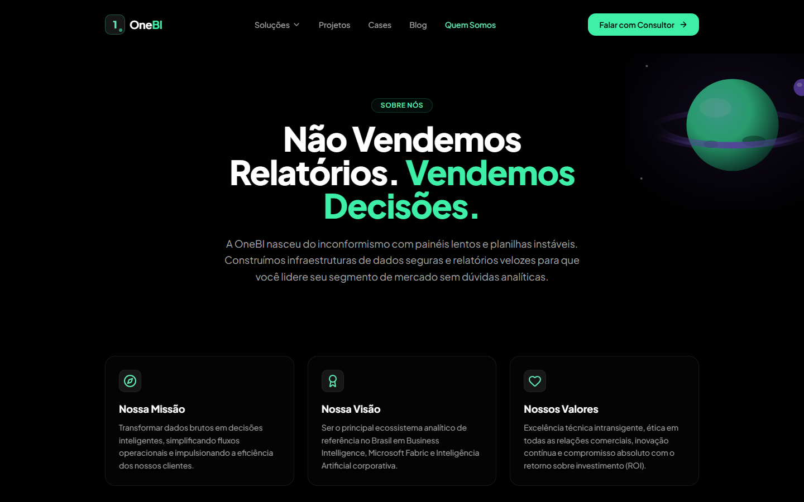
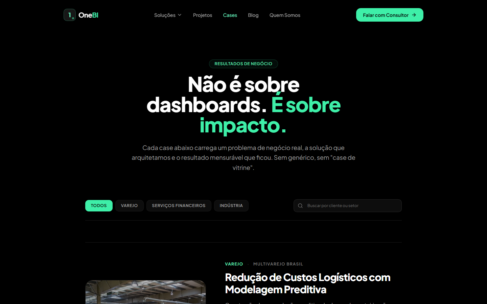
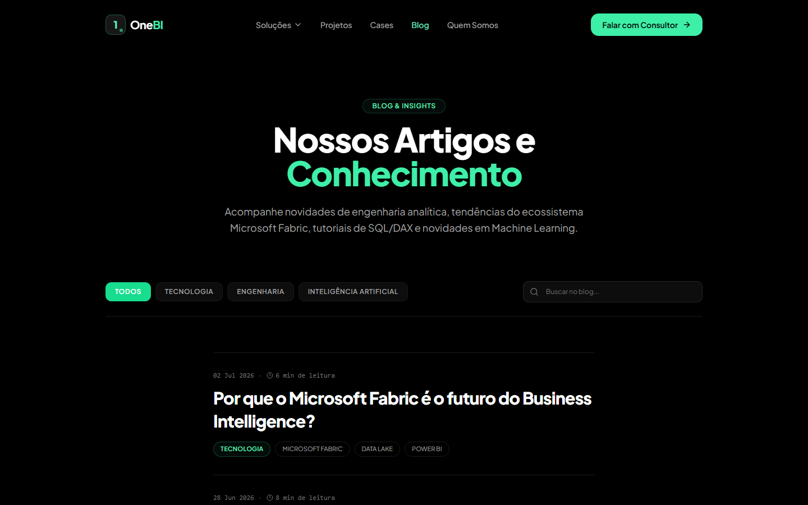
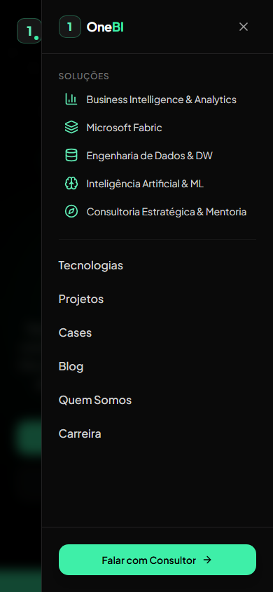

<div align="center">

# OneB

### Plataforma institucional para uma empresa de Business Intelligence, Engenharia de Dados e Inteligência Artificial

[](https://github.com/EvanilsonFreitas/onebi-website/actions/workflows/deploy.yml)


[Demo ao vivo](https://evanilsonfreitas.github.io/onebi-website/) · [Documentação](./docs) · [Reportar um problema](https://github.com/EvanilsonFreitas/onebi-website/issues)

</div>

<br />



<br />

## Sobre o projeto

Este repositório contém o site institucional completo da **OneB**, uma marca fictícia posicionada como referência em Business Intelligence, Microsoft Fabric, Engenharia de Dados e Inteligência Artificial. O projeto foi construído do zero como um exercício de engenharia de front-end de ponta a ponta: fundação técnica, design system próprio, catálogo de páginas institucionais e conteúdo, com foco explícito em qualidade de produção — não um protótipo.

A identidade visual segue um tema espacial (universo, constelações, planetas) sobre um Dark Theme obrigatório, com duas cores de marca:

| Token     | Hex       | Papel                               |
| --------- | --------- | ----------------------------------- |
| Primary   | `#3EF0AA` | Tecnologia, energia, CTAs primários |
| Secondary | `#7E57E1` | Inteligência artificial, destaques  |

O objetivo de negócio simulado é o de qualquer site institucional B2B premium: comunicar autoridade técnica, apresentar soluções e cases reais, publicar conteúdo (blog) e converter visitantes em leads qualificados — sem parecer um template genérico.

## Abordagem

O projeto foi desenvolvido em fases deliberadas, cada uma com um critério de conclusão explícito antes de avançar para a próxima:

1. **Fundação** — scaffolding do projeto (Vite + React + TypeScript), ferramentas de qualidade (ESLint, Prettier, Husky, lint-staged), estrutura de pastas por feature e documentação inicial. Nenhuma página ou componente visual foi criado nesta fase.
2. **Design System** — tokens de marca, tipografia, componentes proprietários (`GlowButton`, `GlassCard`, `Marquee`, `Tabs`, `Modal`) construídos sobre a base do shadcn/ui, e a biblioteca de ilustrações SVG originais.
3. **Páginas e conteúdo** — catálogo completo de páginas institucionais, cada uma com uma identidade visual própria em vez de reaproveitar o mesmo layout de cards repetido em todo o site.
4. **Refinamento** — correções de bugs reais encontrados via teste automatizado no navegador (não apenas leitura de código), ajustes de acessibilidade de cor, responsividade e microinterações.

Todo o conteúdo (cases, depoimentos, posts do blog, dados de clientes) é fictício, mas escrito com o mesmo nível de detalhe e especificidade que um cliente real exigiria — números de KPI plausíveis, arquitetura técnica coerente, citações atribuídas a um cargo e nome.

## Screenshots

<table>
  <tr>
    <td width="50%"><p align="center"><sub>Quem Somos — ilustração de planeta original em SVG</sub></p></td>
    <td width="50%"><p align="center"><sub>Cases — narrativa executiva, não um grid de cards</sub></p></td>
  </tr>
  <tr>
    <td width="50%"><p align="center"><sub>Blog — índice editorial, sem cards</sub></p></td>
    <td width="50%"><p align="center"><sub>Menu mobile — painel off-canvas lateral</sub></p></td>
  </tr>
</table>

## Funcionalidades

- **17 rotas públicas**: Home, Quem Somos, 5 páginas de Solução (com conteúdo e ilustração exclusivos cada), Cases (listagem + detalhe com narrativa Problema/Solução/Impacto), Projetos, Tecnologias, Blog (listagem + artigo), Contato (formulário + agendamento simulado), Carreira (banco de talentos), FAQ e páginas legais (Privacidade, Termos, LGPD).
- **Design system proprietário** sobre a base do shadcn/ui: botões com glow, cards com spotlight que segue o cursor, carrossel infinito (`Marquee`), tabs animadas com indicador deslizante, modais acessíveis.
- **Ilustrações 3D plugáveis**: o componente `Illustration` carrega os assets do tema espacial da marca a partir de `public/Ilustration/` por convenção de nome de arquivo — basta soltar o PNG/WebP na pasta, sem tocar em código. Enquanto o arquivo não existe, o espaço reservado fica vazio, sem quebrar o layout.
- **Formulários validados** com React Hook Form + Zod, cobrindo contato, agendamento de reunião e candidatura no banco de talentos.
- **Camada de serviços** (`src/services`) que abstrai toda a "persistência" de dados simulada — nenhum componente acessa dados diretamente, preparando o projeto para uma futura migração para Supabase sem reescrever a UI.
- **Menu mobile off-canvas**, filtros de conteúdo com animação de entrada/saída corrigida (bug real de `AnimatePresence` diagnosticado e resolvido durante o desenvolvimento), navegação por teclado e foco visível.
- **Deploy automatizado** para GitHub Pages via GitHub Actions, incluindo o contorno padrão de SPA para roteamento client-side (React Router) em um host de arquivos estáticos.

## Stack técnica

**Core**
React 19 · TypeScript (strict, sem `any`) · Vite 8

**Estilo e Design System**
Tailwind CSS v4 (configuração CSS-first, sem `tailwind.config.js`) · shadcn/ui · Class Variance Authority · tailwind-merge

**Roteamento e dados**
React Router DOM · TanStack Query · Axios

**Formulários**
React Hook Form · Zod

**Animação e 3D**
Framer Motion · Lenis (smooth scroll) · Three.js / React Three Fiber / Drei (preparado para cenas 3D)

**Qualidade**
ESLint (flat config, regras type-aware) · Prettier (+ `prettier-plugin-tailwindcss`) · Husky · lint-staged · EditorConfig

**Backend (preparado, não implementado nesta fase)**
Supabase — Auth, PostgreSQL, Storage, atrás de uma camada de services

## Arquitetura

Organização por **features** (domínio de negócio), não por tipo de arquivo:

```
src/
  app/            composição raiz (providers + router + layout)
  assets/         fonts, icons, images, illustrations, logos
  components/
    ui/           base gerada pelo shadcn — não usada diretamente nas páginas
    common/       componentes de propósito geral e ilustrações SVG
    feedback/     modal, skeleton, toasts
    navigation/   navbar, footer, breadcrumb
  constants/      dados mock e constantes compartilhadas
  features/       um módulo por domínio: home, about, blog, cases, solutions...
  layouts/        PublicLayout e variantes
  lib/            utilitários de baixo nível (cn, futuro cliente Supabase)
  routes/         definição de rotas do React Router
  services/       camada de abstração — única porta de entrada para dados
docs/             documentação de arquitetura, design system, roadmap e backlog
```

A documentação completa de cada decisão arquitetural está em [`/docs`](./docs), incluindo o racional por trás de cada escolha técnica (por que Tailwind v4 CSS-first, por que a camada de services existe, etc.).

## Começando

Pré-requisitos: Node.js 20 ou superior.

```bash
git clone https://github.com/EvanilsonFreitas/onebi-website.git
cd onebi-website
npm install
npm run dev
```

O site sobe em `http://localhost:5173`.

### Scripts disponíveis

| Comando                                   | Descrição                                |
| ----------------------------------------- | ---------------------------------------- |
| `npm run dev`                             | Servidor de desenvolvimento com HMR      |
| `npm run build`                           | Typecheck + build de produção em `dist/` |
| `npm run typecheck`                       | Apenas verificação de tipos, sem build   |
| `npm run lint` / `npm run lint:fix`       | ESLint                                   |
| `npm run format` / `npm run format:check` | Prettier                                 |
| `npm run preview`                         | Preview local do build de produção       |

## Deploy

O projeto é publicado automaticamente no **GitHub Pages** a cada push em `main`, via [GitHub Actions](./.github/workflows/deploy.yml): o workflow roda lint e typecheck, gera o build de produção e publica o artefato através de `actions/deploy-pages`.

Como o React Router usa a History API e o GitHub Pages não tem reescrita de rotas do lado do servidor, o projeto inclui o contorno padrão da comunidade ([spa-github-pages](https://github.com/rafgraph/spa-github-pages)): um `public/404.html` que redireciona qualquer rota não encontrada de volta para `index.html`, preservando o caminho original via `history.replaceState`. Isso garante que links diretos para páginas internas (por exemplo `/solucoes/microsoft-fabric`) funcionem normalmente mesmo sem servidor próprio.

## Licença

Projeto de portfólio pessoal. Todo o conteúdo institucional (empresa, cases, depoimentos, artigos) é fictício e criado exclusivamente para fins de demonstração técnica.
